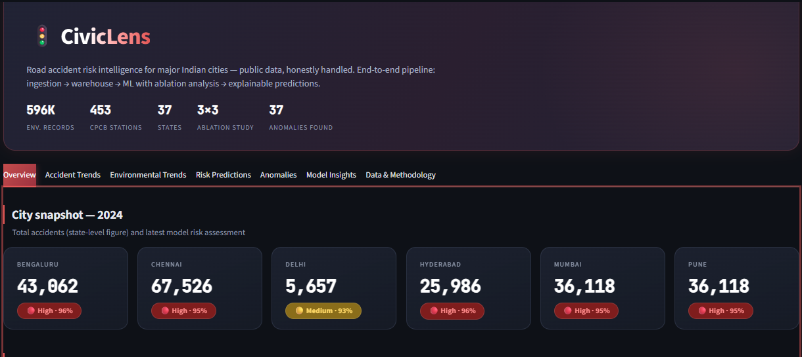
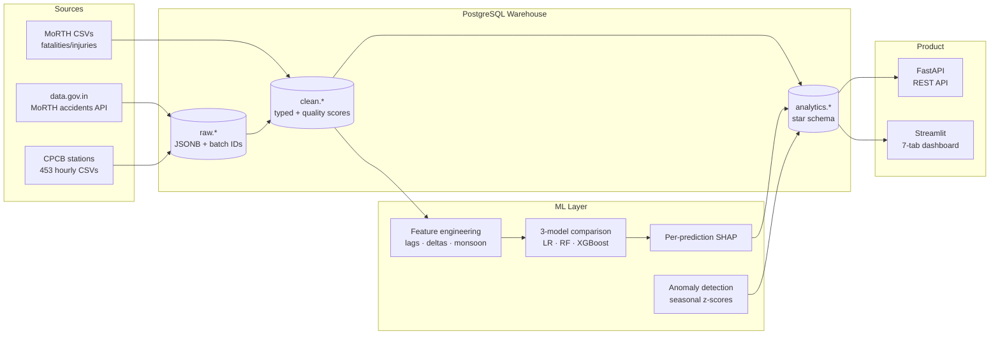
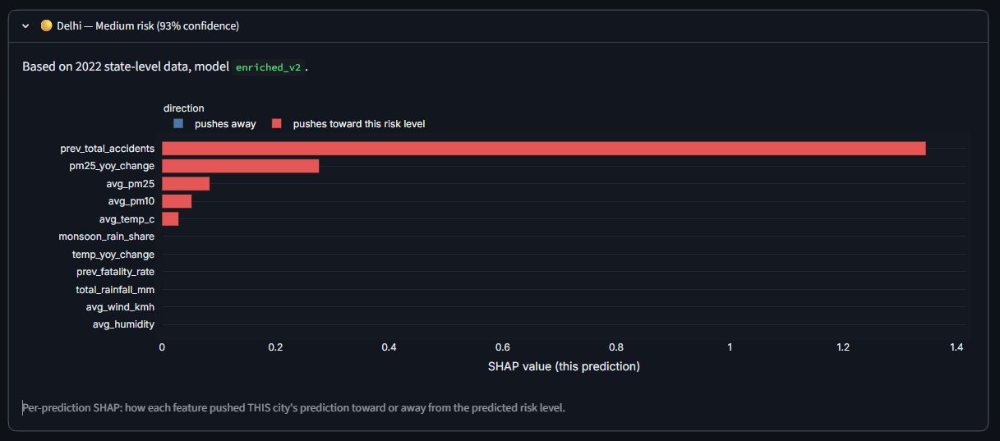

<div align="center">

# 🚦 CivicLens

**Road accident risk intelligence for major Indian cities — public data, honestly handled.**

[](https://github.com/keyurc2332/civiclens/actions/workflows/ci.yml)


*An end-to-end ML system: 3 public data sources → layered Postgres warehouse → ablation-tested models → explainable predictions → REST API + dashboard. Runs with one command.*



</div>

---

## ⚡ Quick start

```bash
git clone https://github.com/keyurc2332/civiclens.git
cd civiclens
docker compose up --build
```

| | |
|---|---|
| 📊 **Dashboard** | http://localhost:8501 |
| 🔌 **API docs** | http://localhost:8000/docs |

Postgres, the API, and the dashboard start pre-seeded with the analytics layer — **no raw data download needed** to explore. Reproducing the full pipeline from source is documented [below](#-reproducing-the-full-pipeline).

## 🎯 What is this?

CivicLens asks one question: **can public environmental data (air quality, weather) predict road accident risk in Indian cities?**

The honest, ablation-tested answer: **yes, but it's a secondary signal — accident history dominates.** Getting to that answer required building a real data platform, and finding a broken government sensor along the way.

### By the numbers

| 596K | 453 | 37 | 3×3 | 37 | 1 |
|:---:|:---:|:---:|:---:|:---:|:---:|
| environmental records | CPCB stations | states modeled | models × feature sets | anomalies detected | faulty sensor caught |

## 🏗️ Architecture



**Stack:** Python · PostgreSQL 16 · Pandera · scikit-learn · XGBoost · SHAP · FastAPI · Streamlit · Docker · GitHub Actions

## 🔍 Key findings

### 1. The ablation study — what actually predicts risk?

Three feature sets × three models, identical stratified cross-validation:

| Configuration | Rows | Features | LogReg | RF | XGBoost |
|---|:---:|:---:|:---:|:---:|:---:|
| **A** · Baseline environment | 73 | 6 | **67.1%** | 63.0% | 60.3% |
| **B** · Enriched environment (no history) | 40 | 9 | 60.0% | **72.5%** | 67.5% |
| **C** · Full (env + accident history) | 23 | 11 | 65.2% | 73.9% | **78.3%** |

- **A:** with simple features + most data, logistic regression wins — classic small-sample behavior
- **B:** engineered environmental features (pollution deltas, monsoon share) genuinely help tree models
- **C:** XGBoost hits 78%, **but** per-prediction SHAP shows `prev_total_accidents` driving every city — much of the gain is accident persistence, and the 93–96% confidences are overfit, not calibrated

> **Bottom line:** environmental conditions carry real but *secondary* signal. Reporting that honestly beats chasing a bigger accuracy number.

### 2. The TN004 story — anomaly detection meets reality

The anomaly detector's first major catch flagged **Chennai's entire 2019 with 10–20× normal rainfall** — during Chennai's famous *"Day Zero" drought year*. That contradiction triggered an investigation:

**Station TN004** (Manali Village, Chennai — new in 2019) had a faulty rain gauge: ~3.3mm/hour average for its entire first year (~20× the city's real annual rainfall), then exactly 0.0 forever after. Classic sensor failure.

**Fix:** excluded only the broken rainfall column (its pollutant readings were fine), documented in code. False positives dropped **75 → 37**, and real events — like Pune's record 2019–20 unseasonal rains — became visible.

> In production ML, anomaly detection catches data-quality faults as often as real events. This project treats that as a first-class finding: **detect → investigate → exclude → document**.

## 📦 Data sources

| Source | What | Grain | Coverage | Access |
|---|---|---|---|---|
| [data.gov.in / MoRTH](https://data.gov.in) | Road accidents | state-year | 2021–2024 | API (with retry + user-agent fix) |
| [CPCB via Kaggle](https://www.kaggle.com/datasets/abhisheksjha/time-series-air-quality-data-of-india-2010-2023) | PM2.5, PM10, NO₂, SO₂, CO + temp, humidity, wind, rainfall | station-hour → city-day | 2010–Mar 2023 | bulk CSV (453 stations) |
| data.gov.in / MoRTH | Fatalities & injuries | state-year | 2021–2024 | CSV download |

<details>
<summary><b>Source quirks worth knowing</b> (click to expand)</summary>

- **data.gov.in blocks Python's default user-agent** — returns 502 unless you send a browser UA (handled in `src/ingestion/base_client.py`)
- **Accident data is state-grain**, so Mumbai & Pune (both Maharashtra) show identical figures — a documented source limitation surfaced in the dashboard, not hidden
- **CPCB's official historical archive was restructured**, breaking the community `vayuayan` package — hence the documented Kaggle bulk export (provenance: Selenium scrape of CPCB's portal)
- **Coverage gap:** environment data ends March 2023, accidents run through 2024 → no 2024 predictions, stated plainly in the product
- Model trains on **all 37 states** for sample size; the dashboard scopes to 6 cities (Mumbai, Delhi, Bengaluru, Pune, Hyderabad, Chennai)
</details>

## 🖥️ The product

### Dashboard — 7 tabs



| Tab | What it shows |
|---|---|
| **Overview** | City cards with accident totals + latest risk chips, trend chart |
| **Accident Trends** | Totals table + year-over-year % change |
| **Environmental Trends** | Monthly PM2.5, temperature, rainfall by city |
| **Risk Predictions** | Model version selector, per-prediction SHAP ("why is *this* city High risk"), honest overfitting caveat |
| **Anomalies** | 37 detected anomalies — filterable table + z-score scatter |
| **Model Insights** | The full ablation table + findings |
| **Data & Methodology** | Sources and limitations, in the UI itself |

### REST API

```
GET /predictions/{city}?model_version=enriched_v2
```
```json
{
  "city_name": "Mumbai",
  "risk_level": "High",
  "confidence": 0.953,
  "top_features": [{"feature": "prev_total_accidents", "shap_value": 1.9308}, ...],
  "caveat": "Model trained on state-year grain public data with a small sample; confidences are not calibrated probabilities..."
}
```

Every prediction ships with its SHAP explanation **and its caveat**. Full endpoint list at `/docs` (auto-generated): `/cities`, `/cities/{city}/accidents`, `/cities/{city}/environment`, `/predictions`, `/models`, `/health`.

## 🔬 Reproducing the full pipeline

<details>
<summary><b>Full setup from raw data</b> (click to expand)</summary>

**Prerequisites:** Python 3.10+, Docker, a free [data.gov.in API key](https://data.gov.in), a free Kaggle account.

```bash
# 1. Environment
python -m venv .venv && .venv\Scripts\activate   # Windows
pip install -r requirements.txt

# 2. Database
docker compose up -d postgres

# 3. Config — copy .env.example to .env, add your API key

# 4. Data — download the Kaggle dataset (link in Data sources above)
#    into data_climate/, plus the two MoRTH CSVs as
#    data_climate/accident_killed.csv and accident_injured.csv

# 5. Run the pipeline (in order)
python scripts/ingest_accidents.py
python scripts/ingest_air_quality.py          # ~15 min, 453 stations
python scripts/ingest_fatalities_injuries.py
python scripts/build_analytics.py
python scripts/train_baseline_model.py        # Phase 1 baseline
python scripts/train_model_v2.py              # enriched + per-prediction SHAP
python scripts/run_ablation.py                # the 3×3 study
python scripts/detect_anomalies.py

# 6. Product
uvicorn src.api.main:app --reload --port 8000
streamlit run src/dashboard/app.py
```
</details>

<details>
<summary><b>Project structure</b> (click to expand)</summary>

```
civiclens/
├── .github/workflows/ci.yml      # ruff + black + pytest on every push
├── config/config.yaml            # cities, resource IDs, model settings
├── docs/
│   ├── engineering_decisions.md  # WHY each choice was made
│   └── PROJECT_BRIEF.md
├── scripts/                      # pipeline entry points (thin, ordered)
│   ├── ingest_accidents.py
│   ├── ingest_air_quality.py     # incl. faulty-station exclusion (TN004)
│   ├── ingest_fatalities_injuries.py
│   ├── build_analytics.py
│   ├── train_baseline_model.py
│   ├── train_model_v2.py
│   ├── run_ablation.py
│   └── detect_anomalies.py
├── seed/                         # analytics snapshot for the demo stack
├── sql/                          # raw / clean / analytics DDL
├── src/
│   ├── api/main.py               # FastAPI
│   ├── dashboard/app.py          # Streamlit (7 tabs)
│   ├── features/engineering.py   # feature sets incl. leakage guards
│   ├── ingestion/                # retrying API clients
│   ├── validation/checks.py      # pandera schemas + quality scoring
│   └── warehouse/db.py
├── tests/
├── docker-compose.yml            # one-command full stack
└── Dockerfile
```
</details>

## ⚖️ Honest limitations

| Limitation | Why it exists | How it's handled |
|---|---|---|
| Accident data is state-grain | That's the published granularity | Documented in dashboard; cities sharing a state share values |
| Small training sample (23–73 rows) | Annual grain × limited year overlap | Cross-validation; confidences flagged as uncalibrated |
| No 2024 predictions | Environment data ends Mar 2023 | Stated in product, not papered over |
| Risk tertiles partly reflect state size | No population normalization yet | Named as top roadmap item |
| Manual pipeline runs | Dagster stubs not wired up | Scripts are idempotent; orchestration is roadmap |

**Why each engineering choice was made** — PostgreSQL vs SQLite, why XGBoost's "win" has an asterisk, why TN004 was only *partially* excluded, why no hyperparameter tuning — lives in [`docs/engineering_decisions.md`](docs/engineering_decisions.md).

<details>
<summary><b>Roadmap</b> (click to expand)</summary>

- Population / road-length normalization (fixes the state-size confound)
- Dagster orchestration (stubs exist)
- Monthly accident data if MoRTH publishes it (unlocks the monsoon features properly)
- Live CPCB "current conditions" feed
- Causal analysis: is the PM2.5 signal real or an urbanization proxy?
</details>

---

<div align="center">

**Built by [Keyur Chauhan](https://github.com/keyurc2332)** · Public datasets used under their open licenses

*If this repo taught you something about honest ML, a ⭐ is appreciated.*

</div>